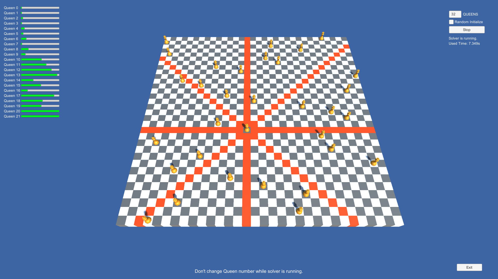
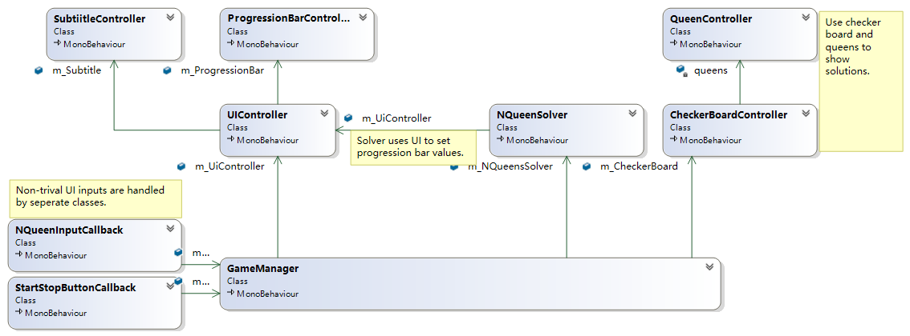

# N Queen Problem Solver
## Screeshot

## Features
* N Queen puzzel solver in a seperate thread, unblocked UI.
* Thread safe setting of the rogression bars.
* Change number of queens, `4 <= n <= 99`.
* Randomized initialization.
* Showing used time of the algorithm.
* Highlighting attacked squares.

## UML Diagram

## Algorithm
The algorithm is implemented in the function `NQueenSolver.SearchQueenPosition(int row)`.

### General Idea
This function recursively search for collumns of the queen in the row, until all rows have valid collumns.

```
Function SearchQueenPosition(row)
    for each candidate collumn do
        if (row, collumn) is a valid position then

            Mark (row, collumn) as used
            
            SearchQueenPosition(row+1)

            Mark (row, collumn) as not used
            
            if solution has been found then:
                return True
            end if

        end if
    end for
end function
```
### Candidate Collumns
Basicly, all `n` (number of queens) collumns are candidate collumns.

But the collumns that are occupied by previous queens can be ruled out by maintaing an array of unoccupied collumns. Remaining collumns are the first `n-row` elements of the array.

For more details see `nQueenSolver.positionCandidates`.

### Legality of a Position
#### row and collumn
Positions are searched row by row, so queens will not be in the same row;

Only collumns in the candidate-collumn-array are searched, so queens will not be in the same collumn;

#### diagnals
Only queens on the same diagnals are to be checked. 

Queens on the same main diagnal have identical values of `row - collumn`;

Queens on the same paradiagnal have identical values of `row + collumn`;

Two tables of used diagnals are maintained. So the legality on diagnals can be checked in O(1) time;

See `nQueenSolver.usedMainDiagnal` and `nQueenSolver.usedParaDiagnal`.

### Randomized Initialization
By default, candidate-collumn-array is initialized as an ordered array from `1` to `n`.

By setting the checkbox, the algorithm will shuffle candidate-collumn-array at the beginning of the algorithm.

This feature provides ability of finding multiple solutions.

### Cancellation
A cancelation flag can be set by main thread. The algorithm thread checks the flag after every step. So the algorithm can exit fastly on request.

## UI
#### Progression Bar
I did not find a way to predict the total number of steps before a solution is found, and couldn't tell an overall percentage of the solver progress. So I use multiple progression bars, each representing one queen. Min/Max number of progression bars can be set.

More bars can show the progress of the algorithm more in detail, but are less performent.

Progression bar values are set by the solver thread, through a thread safe function.

#### Input Number of Queens
This input field will be read only when the algorithm is running. If the user try changing this value during solver running, a warning subtitle will be shown.

#### Random Initialize Checkbox
This Checkbox is only checked at the moment before starting the solver.

#### Start/Stop Button
If the solver is currently idling, pressing the button will start the solver thread.

If the solver is currently running, pressing the button will send a cancellation request to the solver thread by setting the flag.

#### Checkerboard and Queens
Checkerboard is made of black and white cubes.

When pointing at a queen, the attacked squares of this queen are highlighted.